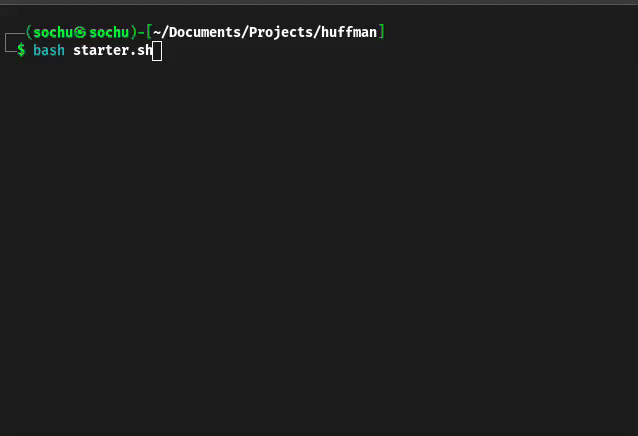

# Huffman-ENCODING-DECODING

Huffman Encoding & DECODING is a compression of a source information.

The program supports **ENCODING** and **DECODING** from both **console** and **file**

Methods used:
  - STATIC
  - DYNAMIC (FGK version)

# USAGE
  1. Download the ***git***:  
### `git clone https://github.com/s0chu/Huffman-ENCODING-DECODING`
  2. Start ***starter.sh***:  
### `bash starter.sh`
  3. Follow the console for information

# DETAILS
## STATIC version
Uses the classical and optimal version for minimizing the average number of bits
Max Code-Word can have a length of ***|Alpha| - 1*** characters, where ***Alpha*** represents the alphabet

Encoding Format: code#ch1#fr_ch1#...#chAlpha#fr_chAlpha
Time complexity: `O(|Text| · |Alpha| · log(|Alpha|))`
## DYNAMIC version
Uses 1 traversal of the source information
Every new character is composed in the encoding of *ESC encoding* + ascii 8 bit of the character
Time complexity: `O(|Text| · |Alpha|)`